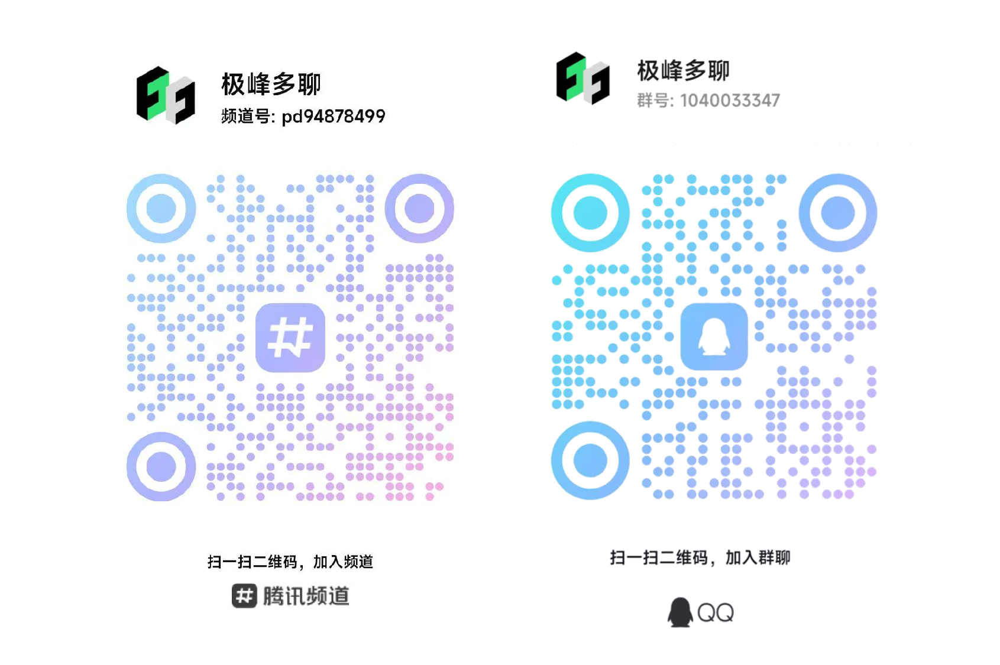

<h3 align="center"></h3>

  
  
   
  
  
  
  

# 极峰多聊

极峰多聊 是一款专为多账号场景设计的桌面端聊天工具管理器，助你轻松管理微信、企业微信、QQ
等多个社交平台账号。无需复杂配置，一键登录、聊天窗口切换、防撤回，聊天更自由，办公更高效。

## 分支说明
注: 分支互相独立, 请勿合并!
- master: 原主分支, 旧版程序依赖的远程配置在此分支, 所以仍保留此分支, 但其中只剩远程配置文件, 之后版本配置文件将在其余分支中维护.
- python: 原master分支中的Python源码在此存放.
- main: 新主分支, 准备用Java实现.
- first: 最初版本, 留个念想...

## 实现原理

- 本项目通过查杀微信等平台的互斥体线程而实现多开
- 选号登录是保存并应用微信等平台存储在本地的配置文件的过程

## 平台功能支持情况

|       | 全局多开 | 防撤回  | 免补丁多开 | 登录状态识别        | △头像自动获取 | △昵称自动获取 | △解密获取 | 免扫码登录      | 侧栏  | 快捷开启 |
|-------|------|------|-------|---------------|---------|---------|-------|------------|-----|------|
| 微信    | √    | √    | √     | √             | √       | √       | √     | √          | √   | √    |
| 微信4.0 | √    | √    | √     | √             | 依赖旧微信   | 依赖旧微信   | 版本更新  | √          | 待优化 | √    |
| 企业微信  | 暂不支持 | 暂不支持 | √     | √(多企业会同时显示在线) | 版本更新    | 版本更新    | 版本更新  | 待优化        | √   | 待优化  |
| QQ    | /    | √    | /     | √             | 版本更新    | 版本更新    | 版本更新  | √          | 待优化 | √    |
| QQNT  | /    | √ | /     | √             | 版本更新    | 版本更新    | 版本更新  | /原生会自动换号登录 | 待优化 | /    |
| TIM   | /    | √    | /     | √             | 版本更新    | 版本更新    | 版本更新  | √          | √   | √    |
|       |      |      |       |               |         |         |       |            |     |      |

## 核心功能

- **win7及以上64位系统可用**
    - win7用户请参考：[win7使用说明](https://github.com/wfql1024/MultiWeChatManager/wiki/How_to_use_in_win7)

- **账号配置管理**：
    - 创建每个账号的配置信息（首次登录账号后会自动保存配置，也可手动配置）
    - 调用已保存的账号配置，实现择号自动登录

- **全局多开及多种多开模式选择**：
    - 以补丁方式修改dll，使得可以不借助软件实现任意打开新微信登录窗口
    - 非全局多开下，可以选择其余的多开模式

- **账号显示、管理功能**：
    - 显示未登录、已登录的账号列表
    - 自动获取账号的昵称、头像等基本信息，也可对账号备注、添加头像，方便管理
    - 手动在详情页获取账号更新的基本信息
    - 可以隐藏账号，可以为账号配置快捷键

- **平台启用、管理功能**：
    - 可以对账号进行启用、隐藏、禁用
    - 隐藏及禁用的账号将不会显示在主页标签
    - 禁用的账号不会参与自动登录

- **聊天窗口切换**
    - 通过侧边栏，快速切换到指定账号聊天窗口

- **防撤回功能**：
    - 通过补丁方式实现平台防撤回功能
    - 防撤回功能可在设置中开启或关闭

- **自启动功能**：
    - 可在设置中开启自启动功能，实现开机自启
    - 可以选择要自启的账号，会在每一次启动时检查并登录应该自启的账号

- **其他功能**：
    - 统计功能
    - 创建启动器，则可以通过不使用本软件，而是快捷方式直接切换到想要的账号登录
    - 调试器，方便反馈
    - 使用代理运行软件

## 使用说明

- 首次使用时，将尝试自动获取相关路径，若获取失败，请手动在设置中修改
- 尚无配置的账号，需要手动登录，登录后会自动保存配置，也可以手动配置，有配置方可使用自动登录
- 若在平台上（非本软件）修改了某账号的设置（如修改了快捷键），需要在设置完成后手动重新配置
- 通过账号详情页面的获取按钮可以获取头像昵称微信号等信息（tips：该方式是通过解密数据库获取，数据随用随删不会上传，仍介意者可不使用）
- 全局多开和防撤回功能皆是通过修改dll文件实现的，需要时需退出相应平台的所有账号
- 本程序除`获取新版本`及`版本适配的热更新`外，其余功能不联网，不会获取用户隐私信息，隐私安全有保障
- 其余功能敬请自由探索

## 常见问题

- **微信**的自动登录功能，会受到登录机制的影响：
    - 若三天未登录过电脑端微信，将需要在手机上点击登录（不需要重新配置）
    - 若七天未登录过电脑端微信，将需要重新扫码（不需要重新配置）
    - 若在新设备登录，需要满三天才会在手机上出现自动登录选项
- 部分平台PC端登录依赖移动端在线，因此PC多号登录需要手机端也多号同时登录
- 某些账号获取详情可能失败，原因暂不明确，但该功能只是获取头像昵称等信息，不影响其他功能
- 反馈交流：

## 支持作者

