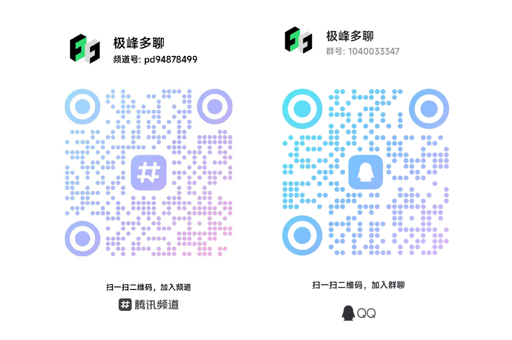

<h3 align="center"></h3>

<p align="center">
  
  
  <br>
  
  
  
  
</p>

# 极峰多聊

极峰多聊 是一款专为多账号场景设计的桌面端聊天工具管理器，助你轻松管理微信、企业微信、QQ
等多个社交平台账号。无需复杂配置，一键登录、聊天窗口切换、防撤回，聊天更自由，办公更高效。

## 实现原理

- 本项目通过查杀微信等平台的互斥体线程而实现多开
- 选号登录是保存并应用微信等平台存储在本地的配置文件的过程

## 平台功能支持情况

|       | 共存多开 | 全局多开 | 免补丁多开 | 防撤回  | 登录状态识别        | △路径自动获取 | △头像,昵称自动获取 | △头像,昵称解密获取 | 免扫码登录        | 侧栏  | 快捷开启 |
|-------|------|------|-------|------|---------------|---------|------------|------------|--------------|-----|------|
| 微信    | √    | √    | √     | √    | √             | √       | √          | √          | √            | √   | √    |
| 微信4.0 | √    | √    | √     | √    | √             | √       | √(截图)      | 版本更新       | √            | √   | √    |
| 企业微信  | √    | 暂不支持 | √     | 暂不支持 | √(多企业会同时显示在线) | √       | √(截图)       | 版本更新       | 待优化          | √   | √    |
| QQ    | /    | /    | /     | √    | √             | √       | √(截图)       | 版本更新       | √            | 待优化 | √    |
| QQNT  | /    | /    | /     | √    | √             | √       | √(截图)       | 版本更新       | /(原生会自动换号登录) | 待优化 | /    |
| TIM   | /    | /    | /     | √    | √             | √       | √(截图)       | 版本更新       | √            | √   | √    |
|       |      |      |       |      |               |         |            |            |              |     |      |

## 核心功能

- **win7及以上64位系统可用**
    - win7用户请参考：[win7使用说明](https://github.com/wfql1024/MultiWeChatManager/wiki/How_to_use_in_win7)

- **账号配置管理**：
    - 创建每个账号的配置信息（首次登录账号后会自动保存配置，也可手动配置）
    - 调用已保存的账号配置，实现择号自动登录

- **全局多开及多种多开模式选择**：
    - 以补丁方式修改dll，使得可以不借助软件实现任意打开新微信登录窗口
    - 非全局多开下，可以选择其余的多开模式

- **账号显示、管理功能**：
    - 显示未登录、已登录的账号列表
    - 自动获取账号的昵称、头像等基本信息，也可对账号备注、添加头像，方便管理
    - 手动在详情页获取账号更新的基本信息
    - 可以隐藏账号，可以为账号配置快捷键

- **平台启用、管理功能**：
    - 可以对账号进行启用、隐藏、禁用
    - 隐藏及禁用的账号将不会显示在主页标签
    - 禁用的账号不会参与自动登录

- **聊天窗口切换**
    - 通过侧边栏，快速切换到指定账号聊天窗口

- **防撤回功能**：
    - 通过补丁方式实现平台防撤回功能
    - 防撤回功能可在设置中开启或关闭

- **自启动功能**：
    - 可在设置中开启自启动功能，实现开机自启
    - 可以选择要自启的账号，会在每一次启动时检查并登录应该自启的账号

- **其他功能**：
    - 统计功能
    - 创建启动器，可以通过不使用本软件，而是快捷方式直接切换到想要的账号登录
    - 调试器，方便反馈
    - 使用代理运行软件

## 使用说明

- 首次使用时，将尝试自动获取相关路径，若获取失败，请手动在设置中修改
- 尚无配置的账号，需要手动登录，登录后会自动保存配置，也可以手动配置，有配置方可使用自动登录
- 若在平台上（非本软件）修改了某账号的设置（如修改了快捷键），需要在设置完成后手动重新配置
- 通过账号详情页面的获取按钮可以获取头像昵称微信号等信息（tips：该方式是通过解密数据库获取，数据随用随删不会上传，仍介意者可不使用）
- 全局多开和防撤回功能皆是通过修改dll文件实现的，需要时需退出相应平台的所有账号
- 本程序除`获取新版本`及`版本适配的热更新`外，其余功能不联网，不会获取用户隐私信息，隐私安全有保障
- 其余功能敬请自由探索

## 常见问题

- **微信**的自动登录功能，会受到登录机制的影响：
    - 若三天未登录过电脑端微信，将需要在手机上点击登录（不需要重新配置）
    - 若七天未登录过电脑端微信，将需要重新扫码（不需要重新配置）
    - 若在新设备登录，需要满三天才会在手机上出现自动登录选项
- 部分平台PC端登录依赖移动端在线，因此PC多号登录需要手机端也多号同时登录
- 某些账号获取详情可能失败，原因暂不明确，但该功能只是获取头像昵称等信息，不影响其他功能
- 反馈交流：

## 支持作者


## 附录：项目目录结构

### txt格式

```
├─📁 components-------------------------#在界面层可复用的基本组件
│ ├─📄 composited_controls.py-----------#自定义的组合套件
│ ├─📄 custom_widgets.py----------------#对基础控件进行重写的自定义控件
│ ├─📄 widget_wrappers.py---------------#控件包装类
│ └─📄 __init__.py
├─📁 data_access------------------------#数据操作层
│ ├─📄 setting.py
│ └─📄 __init__.py
├─📁 docs
│ ├─📄 logic_filter_rules.md
│ └─📄 remote_sw_structure.md
├─📁 external_res-----------------------#引用到的外部资源
│ ├─📄 Feedback.png
│ ├─📄 handle.exe
│ ├─📄 JFMC.ico
│ ├─📄 JFMC.png
│ ├─📄 rewards.png
│ └─📄 Updater.exe
├─📁 functions--------------------------#功能调用, 更常用的功能在这提供接口
│ ├─📄 acc_func.py
│ ├─📄 app_func.py
│ ├─📄 func_tool.py---------------------#中间层, 用来获取实现类
│ ├─📄 sw_func.py
│ ├─📄 wnd_func.py
│ └─📄 __init__.py
├─📁 func_core--------------------------#功能实现
│ ├─📄 acc_func_core.py
│ ├─📄 acc_func_impl.py
│ ├─📄 app_func_core.py
│ ├─📄 sw_func_core.py
│ ├─📄 sw_func_impl.py
│ └─📄 __init__.py
├─📁 public-----------------------------#公用资源, 可被其他包调用
│ ├─📄 config.py
│ ├─📄 custom_classes.py
│ ├─📄 enums.py
│ ├─📄 global_members.py----------------#可在全局调用
│ ├─📄 strings.py
│ └─📄 __init__.py
├─📁 remote_configs---------------------#加密的云端配置源
│ ├─📄 remote_global_v1
│ ├─📄 remote_setting_v7
│ ├─📄 remote_setting_v8
│ └─📄 remote_sw_v9
├─📁 scripts----------------------------#执行的脚本代码
│ ├─📄 build.bat
│ ├─📄 BuildByNuitka.bat
│ ├─📄 click_me_to_create_lnk.bat
│ ├─📄 data_revision.py
│ ├─📄 dir_tree.md
│ ├─📄 dir_tree.txt
│ ├─📄 dir_tree_config.xml--------------#项目结构树配置
│ ├─📄 dir_tree_creator.py--------------#生成项目结构树
│ ├─📄 encrypt_data.py
│ ├─📄 extract_common_features.py
│ ├─📄 fix_project.py
│ ├─📄 original_remote_global_v1.json
│ ├─📄 original_remote_setting_v4.json--#3.3前使用, 修改版本适配结构, 增加特征码适配
│ ├─📄 original_remote_setting_v7.json--#版本适配调整结构以适应新类型扫描方式
│ ├─📄 original_remote_setting_v8.json
│ ├─📄 original_remote_sw_v9.json
│ └─📄 requirements.bat
├─📁 ui---------------------------------#界面层代码，实现界面创建和更新
│ ├─📄 acc_manager_ui.py
│ ├─📄 cfg_manager_ui.py
│ ├─📄 classic_row_ui.py
│ ├─📄 exe_manager_ui.py
│ ├─📄 login_ui.py
│ ├─📄 main_ui.py
│ ├─📄 menu_ui.py
│ ├─📄 sidebar_ui.py
│ ├─📄 sw_manager_ui.py
│ ├─📄 treeview_row_ui.py
│ ├─📄 wnd_ui.py
│ └─📄 __init__.py
├─📁 utils------------------------------#工具类代码，可移植到其他项目中使用
│ ├─📁 better_wx
│ │ ├─📁 legacy
│ │ │ ├─📄 revoke.py
│ │ │ └─📄 unmutex.py
│ │ ├─📄 coexist.py
│ │ ├─📄 inner_utils.py
│ │ ├─📄 revoke.py
│ │ ├─📄 sound_extract.py
│ │ ├─📄 sound_replace.py
│ │ ├─📄 tmp_coexist.py
│ │ └─📄 __init__.py
│ ├─📁 decrypt--------------------------#解密方法
│ │ ├─📄 interface.py
│ │ ├─📄 WeChat_decrypt_impl.py
│ │ ├─📄 Weixin_decrypt_impl.py
│ │ └─📄 __init__.py
│ ├─📁 pywinhandle
│ │ ├─📁 src
│ │ │ ├─📄 pywinhandle.py
│ │ │ └─📄 __init__.py
│ │ └─📄 README.md
│ ├─📄 collection_utils.py
│ ├─📄 diff2files.py
│ ├─📄 encoding_utils.py
│ ├─📄 file_utils.py
│ ├─📄 handle_utils.py
│ ├─📄 hwnd_utils.py
│ ├─📄 image_utils.py
│ ├─📄 logger_utils.py
│ ├─📄 memory_utils.py
│ ├─📄 parser.py
│ ├─📄 process_utils.py
│ ├─📄 sys_utils.py
│ ├─📄 widget_utils.py
│ └─📄 __init__.py
├─📄 @AutomationLog.txt
├─📄 DirectoryV3.xml
├─📄 LICENSE
├─📄 main.py----------------------------#入口，管理员身份及程序参数解析
├─📄 README.md
├─📄 remote_setting_v4
├─📄 requirements.txt
└─📄 update_program.py------------------#升级器
```
